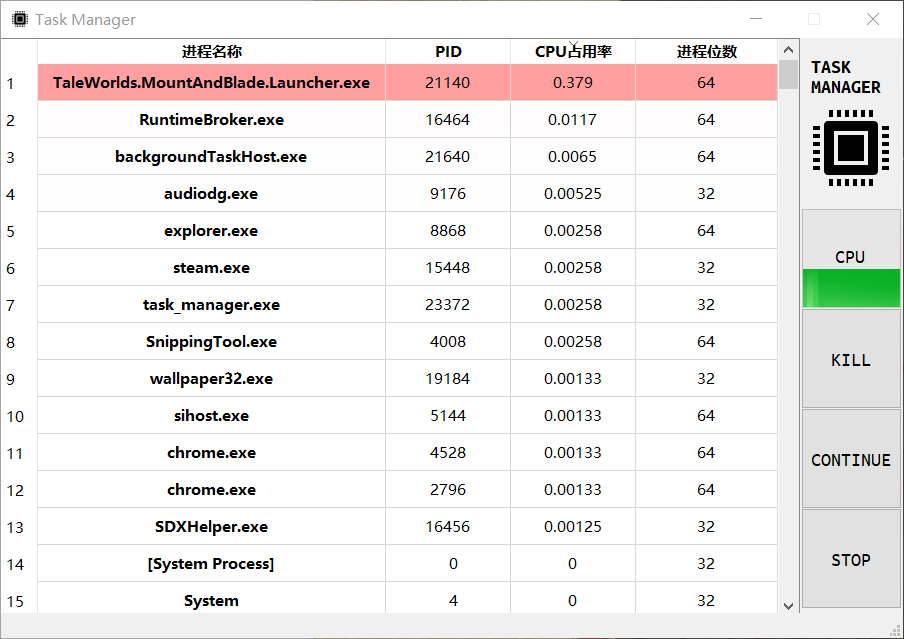
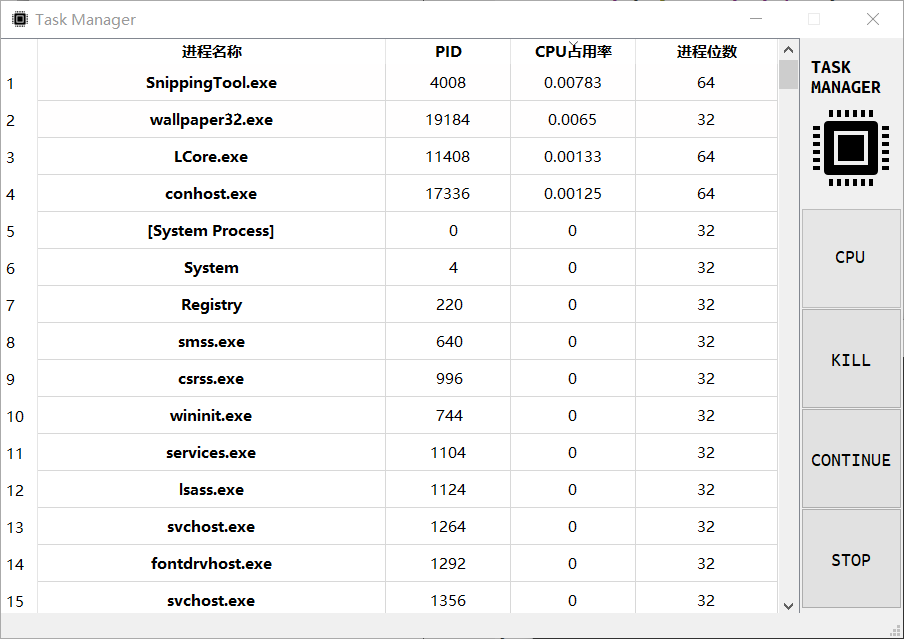
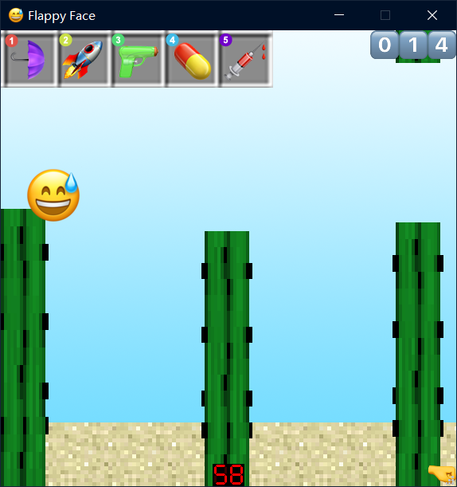
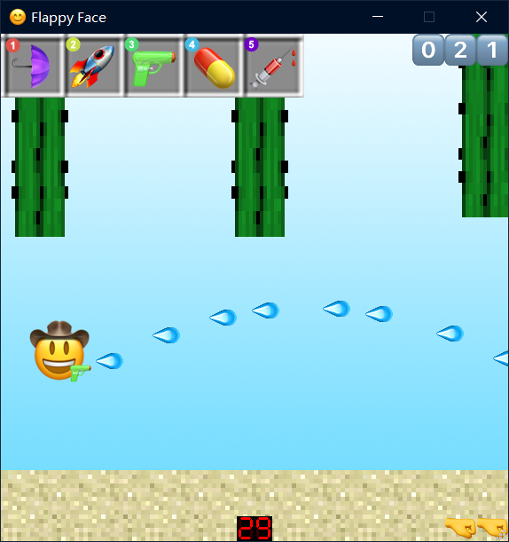

# Simple Task Manager 设计报告

## 一.前言

本次选择的课程设计内容为任务管理器与flappybird类游戏，基于Qt的图形界面，采用面向对象的方法实现。

## 二.设计思路

### 任务管理器



###  １.内核模块划分

将内核程序划分为三个类：**PROCESS_DATA，PROCESS_LIB，TASK_MANAGER**

**PROCESS_DATA**：保存单个进程的名称，CPU占用率，PID等信息，位数，同时提供对占用率，位数的获得方法。

**PROCESS_LIB**：储存所有的进程的PROCESS_DATA，提供读取系统所有进程，根据PID获取某个进程，获得进程信息列表的方法。

**TASK_MANAGER**：提供程序的所有功能界面，根据用户指令对PROCESS_LIB进行操作，或者对其提供的信息进行分析。

**其中PROCESS_LIB只与PROCESS_DATA类进行交互，TASK＿MANAGER只与PROCESS_LIB 类进行交互。**

PROCESS_DATA声明：

```c++
#define NAMELENGTH 260
class PROCESS_DATA
{
public:
	DWORD PID;
	WCHAR NAME[NAMELENGTH];
    LARGE_INTEGER last_time;
	bool is_x64;
	float CPU_PERCENT;
	PROCESS_DATA(PROCESSENTRY32 progress_snap);
	BOOL Is64BitOS();
	BOOL Is64BitPorcess(DWORD dwProcessID);
	float GetProcessCpuPercent(const HANDLE Process_handle, const DWORD dwElepsedTime, int number_of_cores);
};
```

PROCESS_LIB声明：

```c++
#define delay 500
#define MAXIUM_PROCESS 500
class PROCESS_LIB
{
public:
	PROCESS_LIB();
	int Read_System_Process();
	void check_reading();
	void check_processing();
	PROCESS_DATA* Get_process_by_PID(int pid);
	PROCESS_DATA** Get_process_list();
	int Get_Process_Count();
	int get_processor_number();
	void start_processing();
	void stop_processing();
	void start_reading();
	void stop_reading();
	bool reading;
	bool processing;
private:
	PROCESS_DATA* LIB[MAXIUM_PROCESS];
	int PROCESS_COUNT;
	int processor_number;
};
```

TASK_MANAGER声明：

```c++
#define FILENAME "data.txt"
bool cmp_by_pid(PROCESS_DATA* p1, PROCESS_DATA* p2);
bool cmp_by_name(PROCESS_DATA* p1, PROCESS_DATA* p2);
bool cmp_by_cpu_per(PROCESS_DATA* p1, PROCESS_DATA* p2);
class Task_Manager
{
private:
	char mode;
	PROCESS_LIB lib;
public:
	Task_Manager();
	int start();
	int monitor();
	void write();
	int init();
	void Main_menu();
	void show_all_process();
	void show_process_data(PROCESS_DATA* process);
	void search_process();
};
```

### 2.图形界面

mainwindow窗口类声明：

```c++
class MainWindow : public QMainWindow
{
    Q_OBJECT

public:
    int sort_by;//保存排序方式
    MainWindow(QWidget *parent = nullptr);
    ~MainWindow();
    QTimer *timer;
    Task_Manager service;//任务管理器内核
    void operate();//开始显示
    void stuff_table();//填充表格
    void create_items_row(QString process_name,int pid ,double cpu_percent ,bool is_64bit);//根据进程信息填写一列表格
public slots:
    void refresh();//刷新
    void get_sort(int what);//获得排序方式
    void fix_process_status();//修正cpu占用率
private slots:
    void on_pushButton_clicked();//stop

    void on_pushButton_2_clicked();//continue

    void on_pushButton_3_clicked();//kill

private:
    Ui::MainWindow *ui;
};
```

任务管理器的图形界面主要使用Qtablewidget表格类对象，将内核程序获得的进程数据填入表格，实现可视化。

###　２.操作方法

**以管理员权限启动程序**



**单击表头可以按表头内容排序**

**点击右侧stop按钮暂停更新，点击continue按钮继续**

**在列表中选中程序，点击kill结束进程**

**CPU进度条显示当前CPU总占用率**


### flappybird小游戏





### 1.图形界面与游戏规则

**图形界面：**

左侧的黄豆为玩家操控的对象，绿色柱状物体为仙人掌障碍，下方为沙地。左上角为商店，可以通过对应的数字按键购买道具，右上角由emoji构成的数字序列为玩家分数。右下角拳头图标为铁拳导弹剩余数量。下方正中央的数码显示的读数为当前系统的总CPU占用率。

**游戏规则：**

玩家鼠标左键点击控制黄豆跳跃，避开仙人掌障碍，右键点击发射铁拳导弹，摧毁击中的仙人掌，每越过一对仙人掌得一分，每得到5分可以获得一枚铁拳导弹，导弹上限数量为5发，可以通过铁拳导弹换取道具。黄豆落地或者触碰到仙人掌时变成流汗黄豆，游戏结束。结束后鼠标单击重开。

### 2.实现难点思路概述与模块划分

**模块划分：**

共分为两个模块：

*CPU占用率监视模块*：提供函数获得CPU的总占用率

*窗口模块*：提供游戏逻辑，以及绘图方法。

**游戏逻辑：**

参照flappy bird小游戏的设计，小鸟受到重力驱使落地，点击可以使小鸟振翅获得向上的速度，通过不断点击使小鸟停留在空中，躲避障碍物。障碍物的高度由CPU使用率决定，每隔一段时间刷新。

**CPU使用率的获取：**

课设要求程序获取前几个指定数量的进程CPU使用率，经测试发现前几个指定进程的CPU使用率可近似于系统的总CPU使用率，于是直接编写了获取系统CPU使用率的函数，达到精简化处理。

**显示系统：**

本程序使用QT框架，采用QT提供的QTimer计时器，以每16ms刷新一次的频率调用QPainter对窗口进行绘图，同时实现对屏幕的刷新与各对象位置的计算，达到约60fps的流畅图形界面。

**重力模拟：**

在实体对象类中提供加速度与速度参数，每帧调用函数增加对象的速度，再调用运动函数通过给定角度的三角函数，依据速度改变对象的位置，以此可以实现所有游戏内对象的运动。

**碰撞检测：**

每个实体对象中有方形碰撞区域的定义，通过检测碰撞区域的四个顶点是否处于另一个实体对象的碰撞区域内来检测碰撞。

**道具实现：**

本项目设计了五个道具，分别为：

雨伞：可以抵挡一次仙人掌的伤害

火箭：可以摧毁所有经过的仙人掌

水枪：在五秒内自动开火，消灭所有子弹击中的仙人掌

药丸：缩小自身体积

注射剂：减缓时间流逝

## 三.代码分析

**1.实体对象声明**

```c++
#include<QPainter>
class Object
{
public:
    Object(QString image_route,int init_x,int init_y,double init_a,double init_v,int x_size,int y_size,int x_collision,int y_collision,int colbias_x,int colbias_y);
    QPixmap image;
    int x;//实体对象x轴坐标
    int y;//实体对象y轴坐标
    int size_x;//实体对象的x轴尺寸
    int size_y;//实体对象的y轴尺寸
    int bias_x;//实体对象碰撞面积的沿x轴偏移量
    int bias_y;//实体对象碰撞面积的沿y轴偏移量
    int collision_x;//实体对象的碰撞面积x轴宽度
    int collision_y;//实体对象的碰撞面积y轴宽度
    double a;//加速度
    double v;//速率
    bool check_collsion(Object* other);//碰撞检测函数
    void action(double cos,double sin);//沿方向运动函数
};
```

实体对象为一个能显示在窗口上的实体的数据抽象，集成了位置，碰撞体积，图像等。每一个窗口中运动的物体都是该对象。

**2.窗口模块声明**

```c++
#include <QMainWindow>
#include <QTimer>
#include <QMouseEvent>
#include "Objects.h"
#include "cpu_monitor.h"
#include <vector>
#include <QTime>
using namespace std;
QT_BEGIN_NAMESPACE
namespace Ui { class Flappy_face; }
QT_END_NAMESPACE

class Flappy_face : public QMainWindow
{
    Q_OBJECT

public:
    Flappy_face(QWidget *parent = nullptr);
    ~Flappy_face();
    int cpu_percent;//CPU占用率
    int score;//分数
    int missle_magzine;//剩余导弹数量
    void start();//游戏开始
    void stop();//游戏结束
    void restart();//重开
    void update_score(int num);//更新分数
    void mousePressEvent(QMouseEvent *event);//鼠标点击操作函数
    bool status;//游戏状态
    cpu_monitor monitor;//CPU监视器对象
    vector<Object*> blocks;//仙人掌障碍存储器
    vector<Object*> missles;//导弹对象存储器
    Object* face;//黄豆
    Object* background;//背景
    Object* ground;//沙漠
    QPixmap numbers;//数字图标
    QTimer *timer;//帧计时器
    QTimer *block_creator_timer;//仙人掌障碍生成计时器器
    void launch_missle();//发射铁拳导弹
public slots:
    void action();//游戏逻辑计算槽函数
    void new_block();//生成障碍槽函数
    void wait_1_sec();//游戏结束后等待一秒
private:
    Ui::Flappy_face *ui;
    void paintEvent(QPaintEvent * event);//绘图函数
};
```

窗口模块即为游戏窗口，为本程序的核心内容，包含游戏逻辑和显示方法，若要细分模块化，可以将游戏逻辑与窗口分开，但由于本次课设实现的游戏逻辑较为简单，故将其放在一起。

**3.CPU监视器模块声明：**

```c++
#include <windows.h>
#include <stdio.h>
#include <conio.h>
#include <iostream>
using namespace std;
class cpu_monitor
{
public:
    double m_fOldCPUIdleTime;
    double m_fOldCPUKernelTime;
    double m_fOldCPUUserTime;
    double FileTimeToDouble(FILETIME* pFiletime)
    {
        return (double)((*pFiletime).dwHighDateTime * 4.294967296E9) + (double)(*pFiletime).dwLowDateTime;
    }
    BOOL Initialize()
    {
        FILETIME ftIdle, ftKernel, ftUser;
        BOOL flag = FALSE;
        if (flag = GetSystemTimes(&ftIdle, &ftKernel, &ftUser))
        {
            m_fOldCPUIdleTime = FileTimeToDouble(&ftIdle);
            m_fOldCPUKernelTime = FileTimeToDouble(&ftKernel);
            m_fOldCPUUserTime = FileTimeToDouble(&ftUser);

        }
        return flag;
    }
    int GetCPUUseRate()
    {
        int nCPUUseRate = -1;
        FILETIME ftIdle, ftKernel, ftUser;
        if (GetSystemTimes(&ftIdle, &ftKernel, &ftUser))
        {
            double fCPUIdleTime = FileTimeToDouble(&ftIdle);
            double fCPUKernelTime = FileTimeToDouble(&ftKernel);
            double fCPUUserTime = FileTimeToDouble(&ftUser);
            nCPUUseRate = (int)(100.0 - (fCPUIdleTime - m_fOldCPUIdleTime) / (fCPUKernelTime - m_fOldCPUKernelTime + fCPUUserTime - m_fOldCPUUserTime) * 100.0);
            m_fOldCPUIdleTime = fCPUIdleTime;
            m_fOldCPUKernelTime = fCPUKernelTime;
            m_fOldCPUUserTime = fCPUUserTime;
        }
        return nCPUUseRate;
    }
};

```

本模块的代码来源于上次课设的获取CPU占用率代码，不予详细分析。


## 三.存在的问题与解决方案

### 1.找不到获取CPU占用率的方法

解决方案：经查阅大量资料，可以通过OpenProcess函数获取进程句柄，通过调用GetProcessTimes函数获取一段时间内进程占用CPU的时间，通过与CPU核心数的运算获得。

### 2.无法获得部分进程的CPU占用时间

解决方案：经查阅资料，此问题由系统权限原因导致，需要以管理员模式运行此程序。

（获取更高的权限超过本人能力范围QAQ）

### 3.系统CPU占用率太低，障碍物无法生成

可以打开其他游戏提高CPU占用率，再进行游玩。

## 四.程序功能亮点

**①60fps流畅运行**

本程序以16ms一次的速度计算数据刷新界面，为您提供流畅的体验。

**②**~~精美~~**富有特色的图形界面**

本程序的图形界面采用emoji主题，贴近生活，潮流时尚。

**③较为逼真的物理效果**

本程序中，玩家操控的黄豆能以重力加速度下路，较为逼真。

**④简便的操作方式**

只需鼠标就可以操作，非常适合在没有键盘的情况下游玩。

**⑤丰富的道具系统**

有五种不同的道具可供选择

**⑥直观的颜色显示**

根据进程颜色深浅可以得到有关进程CPU占用率的信息，美观且直观
